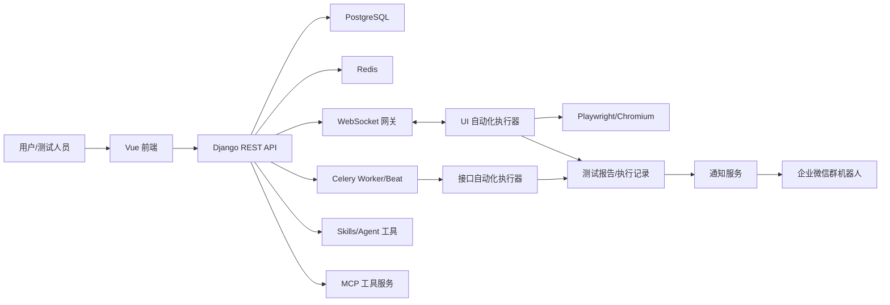
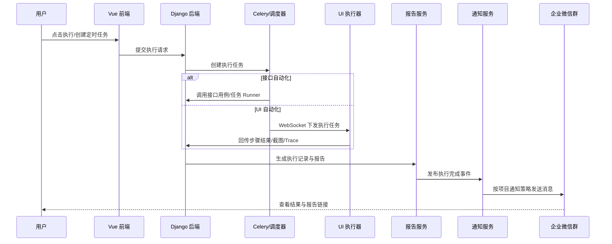

# WHartTest 自动化测试平台二次开发技术方案（评审稿）

版本：v0.1  
日期：2026-06-22  
适用范围：WHartTest 本地/内网部署环境、接口自动化、UI 自动化、任务中心、测试报告、企业微信通知、执行器与部署运维能力  

## 1. 背景与目标

WHartTest 当前采用前后端分离与 Monorepo 组织方式，主要包含 Django 后端、Vue 前端、UI 自动化执行器、MCP 工具服务、Skills 技能库、企业微信插件宿主、PostgreSQL、Redis、Qdrant 等组件。平台已经具备接口自动化、UI 自动化、测试报告、执行记录、任务中心、AI/Skill 辅助能力和 Docker Desktop 本地部署能力。

本次二次开发的目标是围绕“自动化测试闭环”和“本地部署稳定性”进行增强，使平台在日常使用中能够稳定完成以下工作：

1. 支持接口自动化与 UI 自动化统一执行、统一记录、统一报告。
2. 支持执行完成后按需推送企业微信群通知，通知内容包含执行结果与报告入口。
3. 支持任务中心扩展到接口自动化任务，并补齐定时执行能力。
4. 增强 UI 自动化执行器的启动、注册、保活、日志与异常恢复能力。
5. 强化 Skill、Playwright、浏览器进程的资源隔离与超时清理，避免运行一段时间后系统不可用。
6. 保持 Docker Desktop 本地部署开箱可用，改动可复制到镜像模板并可重复启动。

## 2. 现状梳理

### 2.1 当前工程结构

| 模块 | 路径 | 说明 |
| --- | --- | --- |
| Django 后端 | `WHartTest_Django` | 认证、项目、接口自动化、UI 自动化、任务中心、报告、Skills、MCP 集成、企业微信集成 |
| Vue 前端 | `WHartTest_Vue` | 平台 Web 管理端，包含接口自动化、UI 自动化、任务中心、项目管理等页面 |
| UI 执行器 | `WHartTest_Actuator` | 通过 WebSocket 连接后端，使用 Playwright 执行 UI 自动化任务 |
| MCP 服务 | `WHartTest_MCP` | 对外提供 WHartTest 工具能力，默认端口 8914/8915 |
| Skills | `WHartTest_Skills` | Agent/Skill 能力库，包含浏览器自动化、Playwright 等高权限能力 |
| 企业微信插件宿主 | `WHartTest_WeixinPluginHost` | 企业微信相关插件宿主服务 |
| 部署编排 | `docker-compose.yml`、`.env` | Docker Desktop 本地部署，后端端口 8912，前端端口 8913 |

### 2.2 当前关键能力

接口自动化侧已有模块包括：

- `api_modules`
- `api_interfaces`
- `api_testcases`
- `api_testtasks`
- `api_environments`
- `api_database_configs`
- `api_functions`
- `api_sync`

UI 自动化侧已有模块包括：

- `ui_automation`
- `WHartTest_Actuator`
- 前端 `src/features/ui-automation`

通用能力包括：

- `task_center`：任务中心
- `weixin_integration`：企业微信集成
- `skills`：Skill 管理
- `orchestrator_integration`：AI/工具编排
- `langgraph_integration`：LangGraph 对话与工作流
- `mcp_tools`：MCP 工具配置

### 2.3 已知问题与改进方向

| 问题 | 影响 | 建议处理 |
| --- | --- | --- |
| 浏览器自动化 Skill 执行超时后可能残留 Chrome/Node 进程 | 后端 CPU 占满，登录和健康检查超时 | 增加进程树级清理、输出限流、并发限制 |
| 企业微信通知需要手动配置 webhook，且需要能暂停/恢复 | 误发通知或泄露 webhook 风险 | 使用环境变量控制，后台配置脱敏展示 |
| 任务中心偏 UI 自动化，接口自动化任务能力不完整 | 接口测试无法统一纳入任务中心 | 抽象任务类型，统一调度接口 |
| UI 执行器为本地进程，启动和状态感知依赖人工 | 用户不确定执行器是否在线 | 增加执行器状态、心跳、启动脚本、日志入口 |
| 报告入口分散 | 企业微信和任务详情难以直接跳转 | 统一报告链接生成规则 |

## 3. 总体设计

### 3.1 设计原则

1. 最小侵入：优先复用现有 Django App、Vue feature、Celery、WebSocket 和报告模型。
2. 分层解耦：执行、报告、通知、任务调度拆分为独立服务能力，避免执行逻辑直接依赖企业微信。
3. 可配置可回滚：企业微信通知、定时任务、Skill 开关均通过配置控制，可暂停、恢复、回滚。
4. 项目隔离：所有测试用例、任务、报告、执行器、通知策略必须按项目隔离。
5. 稳定优先：所有外部进程、浏览器、Skill、Webhook 请求必须有超时、重试、限流和日志。

### 3.2 总体架构



### 3.3 核心流程



## 4. 功能方案

### 4.1 企业微信通知增强

#### 4.1.1 功能目标

执行接口自动化、UI 自动化测试用例或测试任务后，系统可根据项目配置将执行结果发送到企业微信群。通知应包含：

- 项目名称
- 执行类型：接口用例、接口任务、UI 用例、UI 批量任务、任务中心任务
- 执行状态：成功、失败、部分成功、异常、取消
- 通过数、失败数、跳过数、总数
- 执行耗时
- 执行人或触发来源
- 报告链接或执行记录链接
- 失败摘要，最多展示前 N 条

#### 4.1.2 通知配置

建议使用两级配置：

| 层级 | 配置项 | 说明 |
| --- | --- | --- |
| 全局环境变量 | `WECHAT_WORK_BOT_WEBHOOK` | 默认 webhook，适合本地部署快速启用 |
| 项目级配置 | webhook、通知开关、通知条件 | 项目之间隔离，支持不同群机器人 |

安全要求：

- webhook 不在前端明文展示。
- 后台仅显示脱敏值，例如 `https://qyapi.weixin.qq.com/...key=1383****748c`。
- 支持一键暂停通知：将 webhook 置空或关闭项目通知开关。
- 发送失败不影响测试执行结果保存。

#### 4.1.3 通知触发点

建议采用“执行完成事件”模式，而不是在执行函数里直接发消息：

1. 用例或任务执行完成。
2. 后端保存执行记录、报告、统计结果。
3. 调用统一通知服务 `notification_service`。
4. 通知服务根据配置判断是否发送。
5. 写入通知日志，便于排查。

#### 4.1.4 报告链接规则

| 类型 | 前端入口 | 链接建议 |
| --- | --- | --- |
| 接口自动化测试报告 | `/api-testing` | `${FRONTEND_BASE_URL}/api-testing?reportId={id}` |
| UI 自动化执行记录 | `/ui-automation` | `${FRONTEND_BASE_URL}/ui-automation?recordId={id}` |
| 任务中心记录 | `/task-center` | `${FRONTEND_BASE_URL}/task-center?taskId={id}` |

当前本地部署 `FRONTEND_BASE_URL` 建议为：

```env
FRONTEND_BASE_URL=http://localhost:8913
```

### 4.2 任务中心扩展

#### 4.2.1 当前问题

任务中心当前更偏向 UI 自动化执行场景，接口自动化任务未完全纳入统一任务中心。二次开发建议将任务中心抽象为统一调度层。

#### 4.2.2 任务类型设计

建议新增或统一以下任务类型：

| 任务类型 | code | 执行目标 |
| --- | --- | --- |
| 接口测试用例 | `api_case` | 单个接口自动化用例 |
| 接口测试任务 | `api_task` | 接口测试任务/套件 |
| UI 测试用例 | `ui_case` | 单个 UI 自动化用例 |
| UI 批量任务 | `ui_batch` | 多个 UI 用例批量执行 |
| 自定义 Skill 任务 | `skill_task` | 受控 Skill 执行 |

#### 4.2.3 定时执行

建议基于 Celery Beat 或 `django_celery_beat` 实现：

- 支持每天几点执行。
- 支持每周几执行。
- 支持 Cron 表达式高级模式。
- 支持时区配置，默认 `Asia/Shanghai`。
- 支持任务启用/禁用。
- 支持失败重试次数、超时时间。
- 支持最近一次执行结果和下一次执行时间展示。

前端交互建议：

- 简单模式：每天、每周、每月。
- 高级模式：Cron 表达式。
- 任务详情页展示“下次执行时间”。
- 支持“立即执行一次”。

### 4.3 UI 自动化执行器增强

#### 4.3.1 执行器状态管理

执行器启动后通过 WebSocket 注册，应在后端维护：

- 执行器 ID
- 执行器名称
- 浏览器类型
- 是否无头模式
- 在线状态
- 最近心跳时间
- 当前任务 ID
- 当前执行状态
- 所属项目或允许项目范围

#### 4.3.2 执行器保活与异常恢复

建议机制：

1. 执行器每 15-30 秒发送心跳。
2. 后端超过 60-90 秒未收到心跳则标记离线。
3. 任务下发前检查是否存在可用执行器。
4. 执行中断时记录为异常，不丢失执行记录。
5. 执行器本地清理浏览器上下文、Trace 文件句柄，避免文件占用。

#### 4.3.3 执行器启动方式

本地开发和测试环境建议保留三种方式：

```powershell
cd C:\baiyun\project\WHartTest\WHartTest_Actuator
.\.venv\Scripts\python.exe main.py --no-gui --config config.toml
```

```powershell
cd C:\baiyun\project\WHartTest\WHartTest_Actuator
.\.venv\Scripts\python.exe main.py --gui --config config.toml
```

```powershell
# 打包后使用 start_no_gui.bat 或 start.bat
```

后续可增加 Windows 服务或托盘常驻能力，降低人工启动成本。

### 4.4 Skill 与浏览器资源治理

#### 4.4.1 风险说明

Skills 模块具备较高系统执行权限，浏览器自动化类 Skill 如 `agent-browser-skill`、`playwright-skill`、`playwright-cli` 可能启动 Node/Chrome 子进程。若进程超时后未清理，可能导致后端 CPU 占满，进一步导致登录接口、健康检查和普通 API 超时。

#### 4.4.2 治理措施

建议保留以下防护：

- Skill 命令执行超时后杀整棵进程树。
- 持久化 Playwright 会话超时后清理 Node 与浏览器子进程。
- 限制单次 Skill 输出大小，避免超大 Trace 或日志压垮后端。
- 限制 Skill 并发数。
- 对高风险 Skill 增加启用审批或管理员开关。
- 定期扫描并清理残留浏览器进程。
- 在生产/内网部署中仅启用必要 Skill。

### 4.5 接口自动化增强

接口自动化二次开发建议重点增强：

1. 接口用例、接口任务统一纳入任务中心。
2. 接口任务支持定时执行。
3. 接口执行结果与报告统一生成可跳转链接。
4. 接口执行完成后进入统一通知流程。
5. 接口任务支持项目环境、公共变量、数据库配置、前置/后置函数。
6. 执行失败时在通知中展示失败接口、断言错误、响应状态码。

### 4.6 UI 自动化增强

UI 自动化二次开发建议重点增强：

1. 执行器在线状态在 UI 自动化首页和任务中心可见。
2. 执行记录支持按项目、用例、执行人、执行状态筛选。
3. Trace、截图、步骤结果统一挂载到执行记录。
4. 支持用例和批量任务定时执行。
5. 支持失败重跑和仅重跑失败用例。
6. 执行完成后复用统一企业微信通知服务。

## 5. 数据模型建议

### 5.1 通知配置模型

建议新增或扩展项目级通知配置：

| 字段 | 类型 | 说明 |
| --- | --- | --- |
| project | FK | 所属项目 |
| channel | string | 通知渠道，例如 `wecom` |
| enabled | bool | 是否启用 |
| webhook_encrypted | text | 加密存储 webhook |
| notify_on_success | bool | 成功是否通知 |
| notify_on_failure | bool | 失败是否通知 |
| notify_on_partial | bool | 部分成功是否通知 |
| mention_users | json | 群机器人可选 @ 用户 |
| created_by | FK | 创建人 |
| updated_at | datetime | 更新时间 |

### 5.2 统一执行任务模型

如现有 `task_center` 已有任务模型，可扩展字段；否则建议抽象：

| 字段 | 类型 | 说明 |
| --- | --- | --- |
| project | FK | 所属项目 |
| task_type | string | `api_case`、`api_task`、`ui_case`、`ui_batch` |
| target_id | int | 被执行对象 ID |
| schedule_type | string | manual、daily、weekly、cron |
| cron_expression | string | Cron 表达式 |
| timezone | string | 默认 `Asia/Shanghai` |
| enabled | bool | 是否启用 |
| timeout_seconds | int | 超时时间 |
| retry_count | int | 重试次数 |
| last_run_at | datetime | 最近执行时间 |
| next_run_at | datetime | 下次执行时间 |

### 5.3 通知日志模型

| 字段 | 类型 | 说明 |
| --- | --- | --- |
| project | FK | 所属项目 |
| execution_type | string | 执行类型 |
| execution_id | int | 执行记录 ID |
| channel | string | 通知渠道 |
| status | string | success、failed、skipped |
| request_summary | json | 请求摘要，不包含 webhook 原文 |
| response_summary | json | 响应摘要 |
| error_message | text | 错误信息 |
| created_at | datetime | 创建时间 |

## 6. 接口设计建议

### 6.1 通知配置接口

| 方法 | 路径 | 说明 |
| --- | --- | --- |
| GET | `/api/projects/{project_id}/notification-configs/` | 获取项目通知配置 |
| POST | `/api/projects/{project_id}/notification-configs/` | 创建通知配置 |
| PATCH | `/api/projects/{project_id}/notification-configs/{id}/` | 更新通知开关或 webhook |
| POST | `/api/projects/{project_id}/notification-configs/{id}/test/` | 发送测试消息 |
| GET | `/api/projects/{project_id}/notification-logs/` | 查看通知日志 |

### 6.2 任务中心接口

| 方法 | 路径 | 说明 |
| --- | --- | --- |
| GET | `/api/task-center/tasks/` | 任务列表 |
| POST | `/api/task-center/tasks/` | 创建任务 |
| PATCH | `/api/task-center/tasks/{id}/` | 修改任务 |
| POST | `/api/task-center/tasks/{id}/run/` | 立即执行 |
| POST | `/api/task-center/tasks/{id}/enable/` | 启用 |
| POST | `/api/task-center/tasks/{id}/disable/` | 禁用 |
| GET | `/api/task-center/tasks/{id}/runs/` | 执行历史 |

### 6.3 执行器接口

| 方法 | 路径 | 说明 |
| --- | --- | --- |
| GET | `/api/ui-automation/actuators/` | 执行器列表 |
| GET | `/api/ui-automation/actuators/{id}/` | 执行器详情 |
| POST | `/api/ui-automation/actuators/{id}/offline/` | 手动下线 |
| GET | `/api/ui-automation/actuators/{id}/logs/` | 执行器日志摘要，可选 |

## 7. 前端改造方案

### 7.1 接口自动化页面

入口：`/api-testing`

改造点：

- 报告列表增加“复制报告链接”“发送通知测试”。
- 接口任务增加“加入任务中心”“定时执行”入口。
- 执行完成弹窗展示企业微信发送状态。
- 失败报告中突出失败接口与断言摘要。

### 7.2 UI 自动化页面

入口：`/ui-automation`

改造点：

- 顶部展示执行器在线状态。
- 执行前如无可用执行器，给出明确提示。
- 执行记录增加报告链接、Trace 链接、截图入口。
- 支持将 UI 用例或批量执行配置为定时任务。

### 7.3 任务中心页面

入口：`/task-center`

改造点：

- 增加任务类型筛选：接口任务、UI 任务、Skill 任务。
- 增加调度配置表单：每天几点、每周几、Cron。
- 展示最近一次结果和下一次执行时间。
- 支持手动执行、暂停、恢复、删除。

### 7.4 系统配置页面

建议新增“通知配置”区域：

- 企业微信 webhook 配置。
- 通知条件配置。
- 发送测试消息。
- 通知日志查看。

## 8. 部署方案

### 8.1 Docker Desktop 本地部署

当前建议端口：

| 服务 | 地址 |
| --- | --- |
| 前端 | `http://localhost:8913` |
| 后端 | `http://localhost:8912` |
| Redis | `localhost:8911` |
| MCP | `http://localhost:8914` |
| Playwright MCP | `http://localhost:8916` |
| PostgreSQL | `localhost:8919` |
| 企业微信插件宿主 | `http://localhost:8922` |

关键环境变量：

```env
FRONTEND_BASE_URL=http://localhost:8913
WECHAT_WORK_BOT_WEBHOOK=
WECHAT_WORK_BOT_WEBHOOKS=
CELERY_BROKER_URL=redis://redis:6379/0
CELERY_RESULT_BACKEND=redis://redis:6379/0
```

### 8.2 镜像模板维护

对于本地二次开发镜像，建议维护专用 Dockerfile，例如：

- `Dockerfile.backend-wechat-notify`
- 自定义前端镜像 tag
- `.env` 中固定 `DOCKER_BACKEND_IMAGE` 和 `DOCKER_FRONTEND_IMAGE`

每次涉及后端源码变更时，应确认 Dockerfile 已 COPY 对应文件，否则重建容器后改动不会生效。

### 8.3 执行器部署

执行器建议不放入后端容器，与后端解耦部署：

- 本机 Windows 进程方式：适合当前 Docker Desktop 部署。
- 独立机器执行器：适合多机分布式执行。
- 后续可封装为 Windows 服务或桌面托盘程序。

## 9. 安全设计

### 9.1 访问控制

- 平台建议仅部署在内网或受控网络。
- 默认管理员密码和默认 API Key 必须在生产环境修改。
- 所有项目数据必须按项目成员权限隔离。
- 通知配置、任务配置、执行器管理应限制管理员或项目管理员操作。

### 9.2 webhook 安全

- webhook 视为敏感凭据，不写入前端代码。
- 数据库存储建议加密。
- 日志中禁止打印完整 webhook。
- 导出配置时默认不导出 webhook 明文。

### 9.3 Skill 安全

- 高风险 Skill 默认仅管理员可启停。
- Skill 执行必须有超时限制。
- 浏览器/Node 子进程必须随超时清理。
- 限制 Skill 并发，避免压垮后端。
- 生产环境建议只启用必要 Skill。

## 10. 稳定性与可观测性

### 10.1 日志

建议保留以下日志：

- 后端 API 日志
- Celery Worker 日志
- 任务调度日志
- 执行器日志
- 企业微信通知日志
- Skill 执行日志

### 10.2 健康检查

| 服务 | 健康检查建议 |
| --- | --- |
| backend | `/admin/login/` 或轻量健康接口 |
| frontend | `/` |
| redis | `redis-cli ping` |
| postgres | `pg_isready` |
| weixin-plugin-host | `/health` |
| mcp | TCP 端口探测或 MCP 协议探测 |
| actuator | WebSocket 心跳与后端在线状态 |

### 10.3 资源保护

- 后端容器设置合理 CPU/内存告警。
- 浏览器执行器与后端分离，避免 UI 自动化拖垮后端。
- 大文件如 Trace、截图、报告定期清理。
- 企业微信发送失败设置短超时，不阻塞主流程。

## 11. 测试方案

### 11.1 单元测试

- 通知内容构建。
- webhook 脱敏。
- 报告链接生成。
- 任务调度时间计算。
- 项目权限校验。

### 11.2 接口测试

- 接口用例手动执行。
- 接口任务批量执行。
- 接口任务定时执行。
- 执行完成后报告生成。
- 企业微信通知成功/失败/暂停。

### 11.3 UI 自动化测试

- 执行器启动并注册。
- 无执行器时执行失败提示。
- UI 用例执行成功。
- UI 用例失败时截图与 Trace 保存。
- 批量执行与失败重跑。

### 11.4 稳定性测试

- 连续执行 50-100 次接口任务。
- 连续执行 UI 自动化任务，观察 Chrome/Node 残留。
- 企业微信 webhook 不可用时主流程不受影响。
- Skill 超时后系统仍可登录。

## 12. 实施计划

| 阶段 | 周期 | 内容 | 输出 |
| --- | --- | --- | --- |
| 阶段一 | 1-2 天 | 梳理现有执行链路、报告模型、任务中心模型 | 详细设计与影响清单 |
| 阶段二 | 2-3 天 | 企业微信通知服务、报告链接、通知日志 | 通知闭环 |
| 阶段三 | 3-5 天 | 任务中心支持接口自动化与定时执行 | 统一任务中心 |
| 阶段四 | 2-3 天 | 执行器状态、心跳、前端展示 | 执行器可观测 |
| 阶段五 | 2-3 天 | Skill/Playwright 资源治理、稳定性测试 | 稳定性加固 |
| 阶段六 | 1-2 天 | Docker 镜像模板、部署文档、验收测试 | 可交付版本 |

## 13. 风险与应对

| 风险 | 等级 | 应对 |
| --- | --- | --- |
| Skill 权限高，误执行系统命令 | 高 | 管理员开关、超时、审计、最小启用 |
| 浏览器进程残留导致 CPU 占满 | 高 | 进程树清理、执行器隔离、定期清理 |
| webhook 泄露 | 高 | 加密存储、脱敏展示、环境变量配置 |
| 定时任务重复触发 | 中 | 任务锁、幂等执行、运行状态检查 |
| 多执行器抢占任务 | 中 | 执行器在线状态、任务分配锁 |
| 报告链接本地地址不一致 | 中 | 统一 `FRONTEND_BASE_URL` |
| Docker 模板未同步源码 | 中 | 构建检查清单，固定自定义 Dockerfile |

## 14. 验收标准

1. 接口自动化用例执行完成后生成报告，并可跳转查看。
2. UI 自动化用例执行完成后生成执行记录，截图与 Trace 可访问。
3. 企业微信通知可启用、暂停、恢复，且发送失败不影响测试结果保存。
4. 任务中心可创建接口自动化和 UI 自动化定时任务。
5. 支持每天固定时间执行任务。
6. 执行器在线状态可见，无执行器时前端提示明确。
7. 连续执行测试后后台 CPU 和内存保持稳定，登录接口不超时。
8. Docker Desktop 重启后服务可恢复，配置不丢失。

## 15. 评审关注点

本方案建议评审重点确认以下问题：

1. 企业微信通知是否按项目配置，还是先使用全局 webhook。
2. 接口自动化是否必须全部纳入任务中心，还是先支持接口测试任务。
3. 定时任务是否只做“每天几点”，还是一期直接支持 Cron。
4. 执行器是否需要做 Windows 服务化。
5. 是否允许高风险 Skill 默认启用。
6. 报告链接是否统一使用 `FRONTEND_BASE_URL=http://localhost:8913`。
7. 通知失败是否需要重试，重试次数和间隔如何设置。
8. 测试报告和 Trace 文件保留周期是否需要配置。

## 16. 建议一期范围

为降低改造风险，建议一期优先完成：

1. 企业微信通知服务统一封装。
2. 接口自动化和 UI 自动化执行完成后发送通知。
3. 通知开关支持暂停/恢复。
4. 报告链接统一生成。
5. 任务中心支持接口自动化任务手动执行。
6. UI 执行器在线状态展示。
7. Skill/浏览器进程超时清理与输出限流。

二期再扩展：

1. 项目级 webhook 多配置。
2. 每天/每周/Cron 定时任务。
3. 执行器 Windows 服务化。
4. 通知模板自定义。
5. 失败重跑与多执行器任务调度优化。

